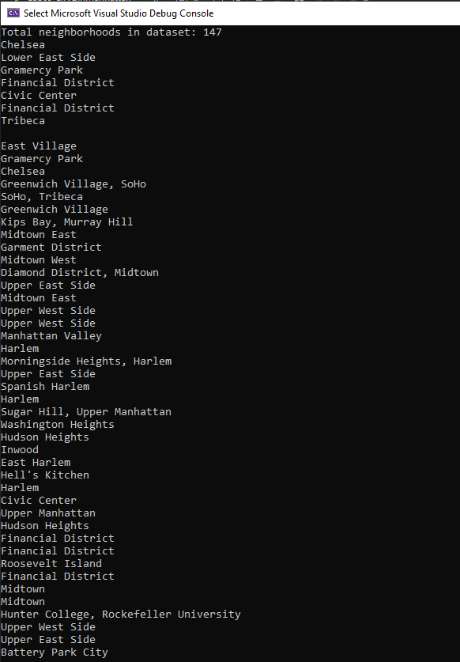

# Lab 09 - LINQ

*Author: Paul M Rest*

----

### Description

A .NET console app that prints to the console the results of filtering down data from a JSON file using LINQ.

Employs both LINQ Method and Query syntax.

---

### Getting Started
Clone this repository to your local machine.

In a command line environment with Git installed:

```
git clone GIT REPO URL HERE
```

### To Run the Program from Visual Studio (2019):
Select ```File``` -> ```Open``` -> ```Project/Solution```

Next navigate to the directory you cloned the repository to.

Double click on the ```Lab09-LINQ``` directory.

Then select and open ```Lab09-LINQinManhattan.sln```

Select ```Debug``` -> ```Start Debugging``` to the run the app with the debugger

OR

Select ```Debug``` -> ```Start Without Debugging```

---

### Visuals



---

### Version

v1.0

### Change Log

#### 2020-07-16
- Converting JSON data to C# objects. 16:51 PDT
- Implemented lab features and method summaries. 18:13 PDT
- Updated README. 18:28 PDT

------------------------------
For more information on Markdown: https://www.markdownguide.org/cheat-sheet
